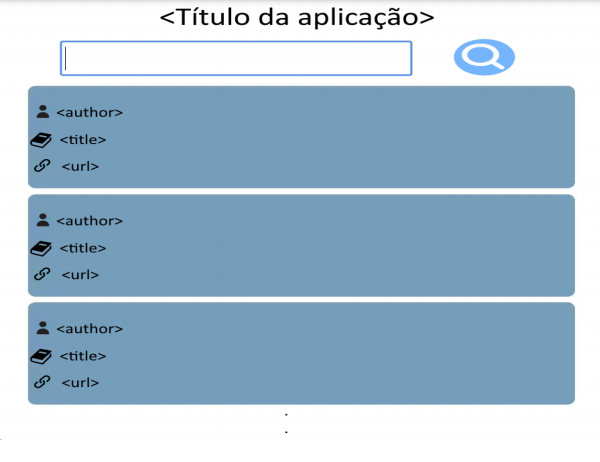

## Descrição

No contexto, o cliente trabalha em uma biblioteca municipal e deseja informatizar o processo de busca, empréstimo e devolução de livros.

Para esta atividade, deverá ser desenvolvida uma aplicação web front-end utilizando a API create-react-app. A aplicação deve processar e requisitar uma lista de livros junto a um Web Service disposto na web, tratar os dados recebidos e exibi-los para o usuário.

A ideia é que a Interface de Usuário (UI) da aplicação disponha de um campo de texto “chave de busca” e um botão “pesquisar”. Assim, quando o usuário clicar em “pesquisar” será exibido uma requisição GET com a URI [https://hn.algolia.com/api/v1/search?query=X](https://hn.algolia.com/api/v1/search?query=X), em que X é o valor de “chave de busca”.

As informações necessárias para a realização da atividade estão disponíveis na apostila do Módulo 1.

Seguem em anexo exemplos de como pode ser desenvolvida a Interface do Usuário da aplicação e como montar a requisição no software web cliente utilizando Postman e a apostila com as definições, respectivamente:

<p align="center">
  
</p>

## Tecnologias
  
- [ReactJS](https://reactjs.org/)
- [Typescript](https://www.typescriptlang.org/)

### Para rodar o projeto

Clone o repositório abaixo. 

```bash
$ git clone https://github.com/MarcosRene/treinamento-osb-modulo-02 && cd treinamento-osb-modulo-02

```

*** Siga os seguintes passos ***

Crie um arquivo .env na raiz do projeto, copie a informação do arquivo .env.example e cole no arquivo .env criado:

```bash
# Instale as dependências
$ npm

# Execute o servidor web
$ npm start
```

O aplicativo estará disponível para acesso em seu navegador em `http://localhost:3000`


